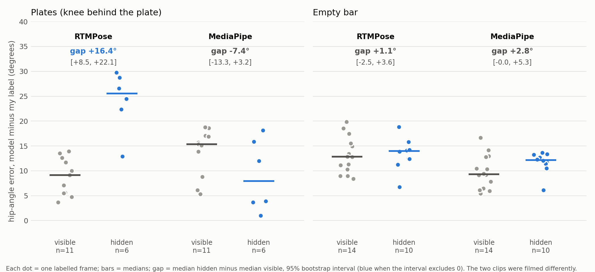

# When a joint is hidden: how pretrained pose models fail behind a barbell plate

A small computer-vision study on my own phone videos of deadlifts. Pretrained pose models are the tool I use to measure joint
angles; this repo asks **what they do when a barbell plate hides the knee, whether the measurement built on top of them breaks,
and whether simple fixes help.** It is a failure analysis, not a new method, and the negative results are part of the point.

## In brief

- **Behind the plate, RTMPose's hip angle is off by roughly 10 to 20 degrees more than on frames where the knee is visible**
  (about +16 degrees, 95% interval [+8.5, +22.1], 6 hidden frames). On the empty-bar clip (frames where the bar or my shorts hid the knee) no such excess is detectable (+1 degree).
- **A controlled test with 3D ground truth partly confirms it, and shows when it matters.** On Fit3D (8 subjects) a plate-sized
  disc drawn over the true knee moves RTMPose's hip angle by about +11 degrees when the lifter is bent over, +7 at mid-range and
  about 0 when upright. The pooled median is only +1.9, which hides this. A disc beside the body does nothing.
- **The model only partly knows it is wrong.** On my real clip its knee confidence is almost the same hidden or visible. With the
  synthetic discs it does drop (AUC 0.83), but a threshold tuned on other subjects also fires on about 30% of frames where the
  knee is visible.
- **The effect depends on the model.** MediaPipe shows no excess in the hip angle on the same frames, although its knee position is
  worse there. A good angle does not mean a well-placed knee.
- **Every simple fix I tried failed or helped only partly:** temporal memory, 3D lifting, interpolation, a limb-length constraint,
  and label-free occlusion detectors. The one clear exception is the bent-over frames of the Fit3D test, where interpolation roughly halves
  the error. Details below.
- **Small data, one lifter.** 6 to 10 hidden frames per clip, two clips filmed differently, my own hand labels as reference.
  Treat this as a well-posed question with a first answer, not as a result to build on.



*Each dot is one frame I labelled. Error is the model's hip angle minus my hand-labelled angle. The offset between the
model and my clicks (about +9 to +15 degrees) is roughly constant from frame to frame, so the number that matters is the gap between
the hidden and visible groups.*

## The question

Pose estimators are trained mostly on people in clear view. In a barbell lift the plate and bar pass in front of the legs and hide
the joints that angle-based analysis needs. When the knee is hidden, a pose model still outputs a position. **How wrong is it, can
it be detected, and can it be repaired?** That is the part of the work this repo documents; occlusion robustness and temporal
consistency matter well beyond lifting.

The project began as a tool for my own squat, bench and deadlift videos (rep counting, joint angles, a per-rep consistency
check; all 28 real reps were found). The occlusion question turned out to be the more interesting part.

## What I measured

Setup: one lifter, four clips filmed from the side with a phone (a deadlift set with plates, one with an empty bar, squat and
bench for rep counting). Two pretrained models, MediaPipe Pose and RTMPose. Hand labels of shoulder, hip and knee on 17 frames of
the plate clip (three sessions, plus a fourth pass with a written rule) and 24 frames of the empty-bar clip. Nothing is trained.

1. **The plate effect on the angle.** On the plate clip RTMPose's hip angle is about 16 degrees worse on hidden-knee frames than on
   visible ones (about 12 degrees when only ascent frames are compared). The size depends on how I guess the hidden knee
   (+9 to +19 degrees across my labelling sessions), so I quote it as "roughly 10 to 20".
2. **A roughly constant offset that is not label noise.** RTMPose's angle differs from my clicks by about +9 degrees (plates) to +13
   (bar) on visible frames. It did not move when I re-clicked with a written rule, so it behaves like the model placing joints
   differently from where I click. Scoring hidden minus visible cancels it.
3. **Confidence is uninformative.** Median knee score 0.58 hidden vs 0.64 visible, ranges overlapping, and no signal on the bar clip.

## A controlled check with 3D ground truth (Fit3D)

My hand labels behind the plate are guesses, and my two clips differ in more than the plate. To remove both problems I used
[Fit3D](https://fit3d.imar.ro/) (motion-capture 3D joints, deadlift videos; 8 subjects, 2 cameras each, 2,344 sampled frames per
version; not included here, licence). I projected the true 3D knee into the image and drew an opaque grey disc the size of a 45 cm
plate on it, then compared each model with itself on the same frame without the disc. A control disc, drawn beside the body with
the knee visible, checks that a disc in the picture is not what moves the model.

| Posture (hip angle on the clean frame) | Frames | RTMPose hip angle, disc over knee | Frames changing by more than 10 deg |
|---|---|---|---|
| bent over (under 100 deg) | 347 | +10.8 deg [+8.4, +14.5] | 58% |
| 100 to 140 deg | 523 | +7.2 deg [+4.7, +10.0] | 34% |
| upright (140 deg or more) | 1465 | +0.4 deg [-0.2, +1.0] | 5% |
| all frames | 2344 | +1.9 deg [+1.1, +2.9] (control disc: +0.1) | 20% |

Intervals are 95% bootstrap intervals over subjects. The bent-over effect (+7 to +11 deg) is in the range I saw on my real clip
(+10 to +20), where the plate also passes the knee during the bent-over part of the lift. MediaPipe has the same sign and a larger
size, and loses the pose on 7% of frames. The posture split was chosen after I saw that the pooled median hides a heavy tail, so
read it as exploratory. Full tables in [docs/RESULTS.md](docs/RESULTS.md#11-controlled-check-on-fit3d-3d-ground-truth).

What the disc hides matters, not only the knee: a half-size disc on the knee cuts the bent-over change from +10.9 to +3.4 deg, and a
disc over the hands alone, with the knee visible, still moves the hip (+1.5 deg upright). Bent over, the hands hang beside the knees, so
a plate in front of the knee hides a region of overlapping limbs. The hip drift cannot be split cleanly between knee and arms.

Detection and repair on this data: knee confidence separates hidden from visible frames better than on my clip. A threshold tuned
on three subjects flags 76% of hidden frames overall and also 29 to 32% of clean or control frames on the five held-out subjects.
Pooled over all frames, interpolating the knee over the hidden blocks does nothing (+2.1 to +1.8 deg), because most frames are
upright and unaffected. Split by posture it does help: in bent-over frames the hip-angle error falls from +11.5 to +5.0 deg with the
true block positions, and to +5.6 deg [+3.2, +7.5] when the blocks are found from RTMPose's own confidence, with no measurable
damage on the frames outside the blocks, although the threshold raises false alarms on 14% (upright) to 69% (mid-range) of unhidden
frames (interpolating a smoothly moving knee is nearly harmless at this sampling). About half of the error remains, because the shoulder and hip also drift, which interpolating the knee cannot
fix. This is a drawn disc on 5 held-out subjects; on my real clips detectors did not carry over from one clip to the other, so I
would not expect this threshold to work on a real plate without testing.

## What I tried to fix it, and what happened

| Approach | Result |
|---|---|
| Swap the model (RTMPose vs MediaPipe) | The excess shows for RTMPose only; MediaPipe's knee is worse but its angle is not |
| Temporal memory (CoTracker3 point tracker, "freeze the knee" control) | The tracker was no better than simply freezing the knee at its bottom position |
| 3D (MediaPipe world landmarks, MotionBERT lifter on RTMPose keypoints) | No better than 2D; the lifter inherits the 2D error. My labels are 2D, so this says nothing about 3D accuracy |
| Oracle interpolation (knee marked missing where I labelled it hidden, then interpolated) | Closes part of the gap (about 16 to 11 degrees); an upper bound, since it uses my labels |
| Limb-length constraint (knee from thigh and shank length) | No better than interpolation, and clearly worse on the bar clip where nothing was hidden |
| Label-free detectors (model disagreement, bone-length deviation, path jumps, confidence) and detect-then-repair | Some separate hidden frames on the plate clip (AUC 0.74 to 0.86, wide intervals) but none works on both clips, and a threshold tuned on one does not carry over |

Two earlier results I retracted after checking: an apparent gain from averaging the two models, and a "7 degree floor" that was
mostly an artefact of how I removed the constant offset. Both are explained in [docs/RESULTS.md](docs/RESULTS.md).

## What this suggests (interpretation, not tested here)

- Pose models are trained to produce a plausible position for hidden joints, so they answer confidently; nothing in their training
  rewards "I cannot see this". That fits the flat confidence scores.
- Fixes that only post-process the output cannot recover information that is not in the 2D input, and repairs such as interpolation can
  damage frames that were fine. A repair is only safe behind a detector that works. On my real clips none carried over from one clip to the other; on the synthetic discs
  RTMPose's confidence was good enough to help when bent over (see above), but I have not shown that on a real plate.
- The literature points to training-time answers: synthetic occluders (for example BlanketGen2-Fit3D, DAG) and video methods that track
  identity through occlusion (SAM-Body4D, 4DHumans). I read these at abstract level. I ran one of the models, HMR2.0 (the single-image model of 4DHumans, which fits a body mesh), on the same Fit3D frames: it was no more robust to the disc than RTMPose (see [docs/RESULTS.md](docs/RESULTS.md)), so a body-shape prior alone did not help here. I did not test occlusion-specific training or the video tracking methods.

## How far to trust this

- The Fit3D check uses a drawn disc, not a real plate (no shadow, blur or depth cue), oblique cameras (about 25 degrees off
  frontal) and the model's own clean prediction as reference, so it measures the change the disc causes, not the total error.
  Posture bins are post hoc.
- One lifter, one gym, two clips filmed at different distances and resolutions, so plate versus bar is **not** a controlled comparison.
- 6 and 10 hidden frames; every interval is wide. Hand labels behind the plate are my best guess, with several degrees of
  uncertainty. The 2D labels cannot judge 3D.
- No claim of generalisation. The plate is also not the only difference between the clips, so I call it a lead, not a cause.

## Next steps

1. **Held-out check, same camera.** Film a plate set with the knee hidden and a set with the knee visible (empty bar or small plates),
   same position and settings, label 15 to 20 frames each, and run the existing scripts unchanged. This removes the camera confound
   and tests whether the findings and the detectors hold up on data they were not built on.
2. **A real reference for the hidden knee.** Fit3D now gives 3D ground truth for a drawn disc (above). A second synchronised camera
   would give it for a real plate; a real plate in front of the leg is still untested against ground truth.
3. **Training-time fixes.** Fine-tune a pose model on synthetic plate occluders and test it on real frames, the direction the literature
   suggests. This needs far more labelled data than I have.

## Repository

| Path | Content |
|---|---|
| `src/pose/` | pose extraction (MediaPipe, RTMPose), point tracker, export for the 3D lifter |
| `src/metrics/` | angles and rep logic, labelling tool, evaluation scripts (`eval_gap.py` is the main metric) |
| `src/fit3d/` | Fit3D occlusion experiment: `run_pose.py` (models on clean and disc-occluded frames), `eval_occlusion.py` |
| `labels/` | my hand labels (CSV); `labels/strict/` is a pass with a written rule |
| `notebooks/` | Colab notebook for the 2D-to-3D lifter |
| `docs/` | [RESULTS.md](docs/RESULTS.md) (all results in detail), [SCRIPTS.md](docs/SCRIPTS.md) (what each script does), figures |

To reproduce the headline figure (needs your own clip in `data/raw/`; footage is not included because it shows a person and a gym):

```
python src/pose/extract_mediapipe.py data/raw/<clip>.mp4
python src/pose/extract_rtmpose.py data/raw/<clip>.mp4 --mode balanced
python src/pose/export_h36m.py <clip>
python src/metrics/eval_gap.py <clip>
python src/metrics/plot_gap.py
```

The Fit3D experiment needs the Fit3D training set (not included) in `data/fit3d/`:

```
python src/fit3d/run_pose.py            # about 50 minutes on CPU, resumable
python src/fit3d/eval_occlusion.py      # output saved in docs/fit3d_eval_output.txt
```

## Related work

Stanford CS231n 2024, *Automating powerlifting judging through keypoint detection* (pretrained keypoints plus rules).
Occlusion-robust pose estimation: [DAG](https://arxiv.org/abs/2401.00155), [BlanketGen2-Fit3D](https://arxiv.org/abs/2501.12318),
[SAM-Body4D](https://arxiv.org/abs/2512.08406), [4DHumans](https://openaccess.thecvf.com/content/ICCV2023/html/Goel_Humans_in_4D_Reconstructing_and_Tracking_Humans_with_Transformers_ICCV_2023_paper.html).

## Privacy

Raw video, Fit3D data and generated overlays are excluded (`.gitignore`) because they show a person and a gym.
