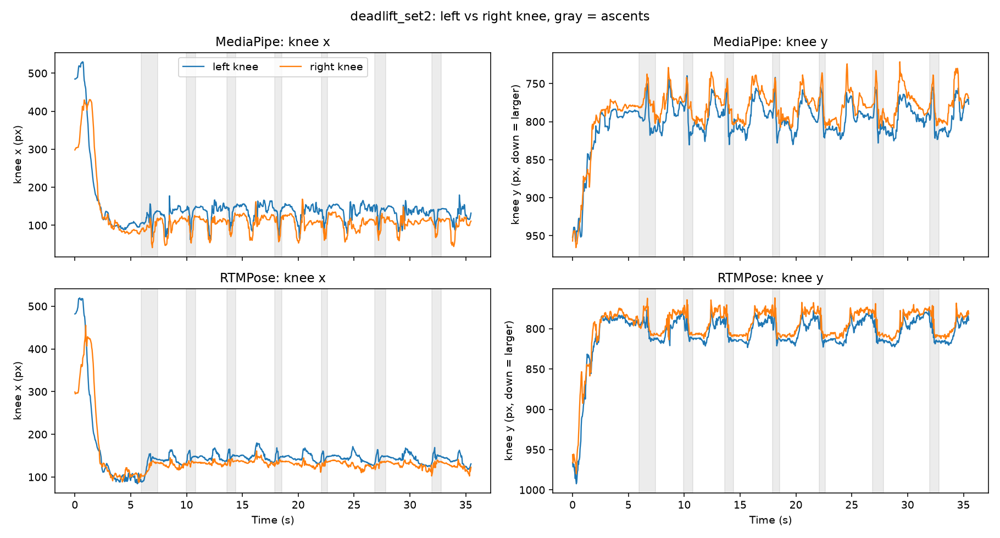

# Detailed results

Appendix to the [README](../README.md); the section numbers are referenced from there.
Everything comes from one lifter, four phone clips filmed from the side, and hand labels on 17 frames of the plate clip
(three sessions, plus a fourth pass with a written rule) and 24 frames of the empty-bar clip (one session). Read all numbers as indicative.

### 1. Rep detection

| Clip | Detected | Real reps | Note |
|---|---|---|---|
| Squat (bodyweight) | 5 | 5 | |
| Bench | 8 | 8 | |
| Deadlift, empty bar | 9 | 8 | the extra detection is the walk-in and bar pick-up at the start |
| Deadlift, plates | 7 | 7 | |

All 28 real reps were found; one extra detection came from the clip starting before I was set up.

### 2. Per-rep consistency check

A rep is flagged if its bottom angle is more than 15 degrees from the set median, or its ascent time is
more than 35% from the median. Thresholds were set before looking at results and not tuned.
"Clean" here means **consistent with the rest of the set, not good technique or safe**.

Of 28 reps, one was flagged: rep 1 of the plate deadlift (about 14 degrees deeper, ascent about 1.75 times
the median) after a roughly 2.5 s grip pause. Both pose models agree it is a slow first pull, and I
confirmed the pause in the video. No other set showed a slowdown, so I make no claim about fatigue.

### 3. Pose models around the plate (deadlift with plates, one clip)

**Trajectories (no labels needed).**

| | MediaPipe | RTMPose |
|---|---|---|
| Frame-to-frame angle noise | 1.05 deg | 0.75 deg |
| Reps detected | 7 | 7 |

- The two models place shoulder, hip and knee within about 1 to 1.5% of image height of each other
  (typically), but their hip-angle curves differ by more than 10 degrees in 34% of frames, and those
  disagreements concentrate in the ascents, when the plate rises past the knees.
- Plotting left and right knee over time (`knee_paths.py`) shows no near/far leg swap. MediaPipe's knee
  makes excursions of roughly 60 to 100 px around each ascent, larger than the gap between the legs;
  RTMPose's are much smaller.
- A bone-length filter (`clean_keypoints.py`) lowers the jitter (MediaPipe 1.05 to 0.85 deg) but does not
  change the error against hand labels, because errors that rotate the thigh keep its length.



**Against hand labels (17 frames from this clip, 6 with the knee hidden by the plate).**
I clicked shoulder, hip and knee on frames chosen mostly from the ascents (`label_frames.py`, scored by
`eval_labels.py`). Labels are the average of three sessions (A, B, and C a day later, same frames, shuffled).
Errors are medians, as % of the labelled torso length (about 140 to 160 px). My own repeat error between
sessions, over all frames, was 2.4 to 3.4% (shoulder), 3.0 to 4.3% (hip) and 5.4 to 6.6% (knee). That is the noise
floor: knee differences of about that size or smaller cannot be told apart. (I did not separate the hidden frames.)

Both models differ from my clicks by a constant amount (measured with the first two sessions): both put the
shoulder 13 to 21 px higher and the knee 10 to 12 px behind where I click (I click the front of the kneecap, they place the joint centre). This is a
labelling-convention gap, not a plate effect, so the table also shows the error after removing each model's
average offset (estimated on the other frames, leave-one-out):

| Error after removing the average offset | MediaPipe | RTMPose |
|---|---|---|
| Knee position, all frames (% torso) | 11.5 | 6.4 |
| Knee position, knee visible (n=11) | 9.3 | 5.4 |
| Knee position, knee hidden (n=6) | 24.6 | 10.0 |
| Hip angle, all frames (deg) | 4.4 | 8.8 |
| Hip angle, knee visible (deg) | 3.8 | 5.5 |
| Hip angle, knee hidden (deg) | 7.6 | 14.0 |

(Without the offset removal, the hip-angle error is 15.1 deg for MediaPipe and 12.6 deg for RTMPose.)

- RTMPose places the knee closer to my labels than MediaPipe in every subset I looked at, including behind
  the plate (hidden: 10.0 vs 24.6, about 3.7 times my own repeat error for MediaPipe). MediaPipe is slightly
  better on the shoulder.
- That does **not** carry over to the hip angle, which is what the rep analysis uses: MediaPipe's median
  angle error is lower in every subset (4.4 vs 8.8 deg overall, 7.6 vs 14.0 behind the plate), and its 90th
  percentile too (8.5 vs 15.2 deg). With 17 frames, and hand labels that are themselves a guess behind the
  plate, I treat this as a tendency on one clip, not a settled ranking.
- The measured angle error (median 4 to 9 deg, 90th percentile 8 to 15 deg) is comparable to the 15 deg
  tolerance of the rep-depth check, so single-rep depth flags near the threshold are not reliable.

**The same labelling on the empty-bar deadlift (24 frames, no plate, 10 of them marked "knee hidden").**
Same procedure and convention, one labelling session. Here the knee is hidden by the bar or by my shorts
(my own judgement per frame), not by a plate. Error after removing the average offset, medians:

| | MediaPipe | RTMPose |
|---|---|---|
| Knee position, all frames (% torso) | 4.9 | 5.1 |
| Knee position, knee hidden (n=10) | 5.3 | 4.8 |
| Hip angle, all frames (deg) | 1.6 | 2.5 |
| Hip angle, 90th percentile (deg) | 5.4 | 8.3 |

Next to the plate clip, MediaPipe's knee error is about 2.3 times lower overall (11.5 to 4.9) and its
hidden-knee error about 4.6 times lower (24.6 to 5.3). RTMPose changes much less (6.4 to 5.1), and its
hip-angle error is lower in the empty-bar clip (8.8 to 2.5 deg; MediaPipe 4.4 to 1.6). A knee hidden by the bar or shorts is therefore
not what makes MediaPipe fail; the bar is thin, though, so it hides far less of the leg than a plate. That points to the plate, but it is **not established**: the two clips
differ in camera distance and resolution, the sets have 17 and 24 frames, and all labels are mine (set 2 is the average of three sessions, set 1 is a
single session, which if anything makes the plate clip look slightly better than it is). The raw
errors before offset removal are large in both clips (hip angle about 11 to 15 deg), because of the
click-versus-joint-centre convention gap (model hip about 11 to 13 px below my click, knee about 15 to 19 px
to the side).

**[TODO]** More labelled frames on same-camera footage with and without plates.

For comparison, the empty-bar deadlift was about 2.6 times less noisy (0.40 vs 1.05 deg) with far fewer
low-confidence frames (2% vs 44%). That pair is confounded: the two clips differ in camera distance and
resolution, so it does not isolate the effect of the plate.

### 4. Does temporal memory help? (plate clip, 17 labelled frames)

Idea: the plate hides the knee, so give the system a memory: take the knee at a moment when it is visible and carry
it through the frames where it is hidden. I tried a point tracker (CoTracker3, pretrained, run on a Colab GPU) and a
control that just copies the knee position from the bottom of the rep to every frame of that rep (`hold_knee.py`).

- **First attempt failed.** I anchored the tracker on the first frame of each rep. In this camera view the plate
  already covers the knee at lockout, so the tracker was given a point on the plate and followed the plate to
  the floor (median knee error about 185% of torso length). Lesson: the anchor must be a frame where the knee is visible.
- **Second attempt (anchor at the bottom of the rep, tracked both ways)** behaves sensibly: it stays in the knee region
  and reports "not visible" on the frames where the plate crosses the knee.

Error after removing the average offset, medians (laid out as in section 3):

| | Knee, all (% torso) | Knee, hidden (n=6) | Hip angle, all (deg) | Hip angle, hidden (deg) |
|---|---|---|---|---|
| MediaPipe | 11.5 | 24.6 | 4.4 | 7.6 |
| RTMPose | 6.4 | 10.0 | 8.8 | 14.0 |
| Point tracker (anchored at the bottom) | 6.5 | 10.9 | 4.5 | 7.0 |
| Control: knee held still at its bottom position | 5.3 | 5.6 | 4.2 | 7.2 |

**The tracker did not beat the control.** On the knee the tracker is no better than per-frame RTMPose (6.5 vs 6.4)
and worse than the control (5.3), and its 90th-percentile knee error is higher (14.9 vs 9.6 overall, 19.7 vs 11.2 behind
the plate). On the angle, MediaPipe, the control and the tracker are about equal (4.2 to 4.5 deg overall); RTMPose is
worse (8.8 deg), and since the control and tracker use RTMPose's shoulder and hip, that error comes from its knee point.
In a deadlift the knee barely moves in the image, so a frozen position is a strong baseline.
What does look useful is anchoring on a clear frame (the control beat per-frame RTMPose on the knee: 5.3 vs 6.4 overall,
5.6 vs 10.0 behind the plate), but the hidden-frame gap (4.4) is smaller than my own knee repeat error (5.4 to 6.6),
so it is within noise, even though it points the same way as with the first two sessions. The tracker's design was changed after the first failure, on this
same clip, so these numbers are development results. The "bottom" rows are partly circular, since the anchor frame is
a bottom frame. I would expect memory to matter more for a joint that moves while hidden, which I have not tested.

**[TODO]** Test the frozen protocol, with the control, on new same-camera footage.

### 5. Timing numbers depend on the model

MediaPipe's curve suggested the last reps of the plate set were slower (0.97 and 0.87 s ascent). RTMPose
gives about 0.57 s for the same reps. I attribute this to the misplaced knee distorting the angle near
lockout, and I do not report it as a fatigue effect.

### 6. Exploratory 3D check (MediaPipe world landmarks)

MediaPipe also outputs 3D "world" landmarks (metres, estimated from the single image, so depth is a model guess).
`world3d.py` asks two questions on the labelled frames of the plate clip (17) and the empty-bar clip (24).
RTMPose has no 3D output here, so this covers MediaPipe only.

- **Bone-length stability.** In 3D the thigh, shank and torso should keep a constant length. On the plate clip their
  median deviation from the clip median is about 3 to 5%, and it is not larger on the frames where I marked the knee as hidden.
  On the empty-bar clip the thigh varies more (about 8%), which I cannot explain.
- **Hip angle against my labels** (median error in degrees, mean bias removed per variant, leave-one-out):

| | Image pixels (2D) | World x,y only | World x,y,z (3D) |
|---|---|---|---|
| Plates, all frames (n=17) | 5.2 | 5.2 | 6.4 |
| Plates, knee hidden (n=6) | 7.6 | 4.9 | 8.8 |
| Empty bar, all frames (n=24) | 2.4 | 3.7 | 6.6 |
| Empty bar, knee hidden (n=10) | 2.0 | 4.4 | 7.3 |

The full 3D angle is not better than the 2D one in any row. The one favourable cell (world x,y, plates, hidden) has 6 frames, so I do not read it as a result.

Is the gap larger than chance? Median of (3D error minus pixel-2D error) over the labelled frames, with a 95% bootstrap interval (resampling frames):

| | World x,y,z vs 2D | World x,y vs 2D |
|---|---|---|
| Plates (n=17) | +2.2 deg [-1.0, +4.2] | +1.2 deg [-1.9, +2.2] |
| Empty bar (n=24) | +5.2 deg [+1.8, +7.1] | +2.1 deg [-0.1, +3.4] |

On the plate clip the 3D angle is **not distinguishable** from the 2D one with 17 frames. On the empty-bar clip it is worse, and the interval excludes zero.

I expected depth to add frame-to-frame noise, but over all frames the 3D angle is not noisier than the 2D one (median change per frame about 1.3 to 1.5 deg in all three variants, `world3d.py` section 4).
If depth is off, it is off consistently rather than jittery. Two untested explanations remain: the 3D angle and my 2D label angle measure different things when
the thigh is not parallel to the image plane (the mean 3D-minus-2D difference is +4.8 and +7.3 deg), or the model's depth is biased for this pose.

**What this does and does not show.** My labels are 2D image points, so a 3D angle is compared with a 2D label angle. There is no 3D ground truth,
which means I can say the 3D angle does not agree better with my 2D labels, but not how accurate the 3D estimate is. From a side camera,
depth is exactly what the model cannot see. These numbers are not comparable with those in section 3, which remove the
average offset on joint positions; here the bias is removed on the angle.

**[TODO]** A way to check 3D that does not rely on my 2D labels (a second camera view, or a dataset with 3D ground truth).

### 7. A real 2D-to-3D lifter on the RTMPose keypoints (MotionBERT-Lite)

To separate "3D does not help" from "MediaPipe's single-frame depth is poor", I fed the RTMPose keypoints (converted to the 17-joint Human3.6M layout by
`export_h36m.py`) to a pretrained temporal lifter, MotionBERT-Lite (`notebooks/lift3d_motionbert.ipynb`, run on Colab; evaluated with `eval_lift3d.py`).
Same labels, same procedure as section 6. Hip-angle error against my labels, degrees, median, mean bias removed (leave-one-out):

| | Plates, all (n=17) | Plates, knee hidden (n=6) | Empty bar, all (n=24) | Empty bar, knee hidden (n=10) |
|---|---|---|---|---|
| RTMPose pixels (2D, the lifter's input) | 8.6 | 12.0 | 2.2 | 1.0 |
| Lifted x,y,z (3D) | 7.6 | 11.7 | 1.5 | 1.7 |
| Lifted minus 2D, 95% bootstrap interval | +0.09 [-0.11, +1.30] | | -0.58 [-1.89, +0.24] | |

- **On the plate clip lifting does not repair the occlusion error.** The 3D angle is not distinguishable from the 2D one (7.6 vs 8.6 deg overall, 11.7 vs 12.0 behind the plate), and it stays well above MediaPipe's 2D error on the same clip (5.2 deg overall, section 6). The knee error that RTMPose makes behind the plate goes into the lifter and comes out again.
- **On the empty-bar clip everything is accurate** (1.5 to 2.2 deg) and the lifted angle is slightly closer to my labels, but the interval includes zero.
- **The lifted 3D angle stays close to its own 2D input** (mean difference +0.7 and +0.1 deg, median absolute difference 2.9 and 3.7 deg), whereas MediaPipe's world landmarks differed from its pixels by a mean of +4.8 and +7.3 deg (section 6). This weakens the idea that the 3D-minus-2D gap in section 6 is just a side-view projection effect, and points more to MediaPipe's depth estimate, which is a single-frame regression. That is a suggestion, not a test: the two pipelines also differ in input keypoints and training.
- The lifted angle is smoother from frame to frame (median change 1.12 vs 1.26 deg on the plate clip, 1.31 vs 1.47 on the empty-bar clip), as expected from a model with a time window, but not closer to my labels where the input was wrong.
- Setting the confidence channel to 1 (instead of RTMPose's score) made the lifted shank length vary more on the plate clip's hidden frames (21% vs 5.5% median deviation, 6 frames). Tentative: it suggests the lifter uses low scores when the knee is covered.

Limits as in section 6: my labels are 2D, so this says nothing about how accurate the 3D itself is; I assume the lifter's x,y are the image-plane axes; 17 and 24 frames; one labeller.

### 8. Oracle masking: can the lifter use time to repair a hidden knee?

RTMPose gives the hidden knee almost the same confidence as a visible one (median score 0.58 vs 0.64 on the plate clip, ranges overlapping), so the lifter has no signal that the knee is lost.
To see whether MotionBERT *could* use temporal context, I marked the left knee as missing in a window of +-K frames (K=5 or 15, about 0.17 or 0.5 s) around each frame where I marked it hidden, and lifted again.
**This uses my labels to say where the knee is lost, so it is an upper bound, not a usable method.** Variants: `conf0` (knee confidence set to 0), `zero` (knee x,y and confidence set to 0),
`interp` (knee x,y replaced by linear interpolation from outside the window), and a lifter-free baseline: the 2D hip angle from RTMPose with the interpolated knee (`eval_masking.py`).
Hip-angle error against my labels, degrees, median, mean bias removed (leave-one-out):

| | Plates, all (n=17) | Plates, hidden (n=6) | Empty bar, all (n=24) | Empty bar, hidden (n=10) |
|---|---|---|---|---|
| RTMPose 2D, no masking | 8.6 | 12.0 | 2.2 | 1.0 |
| Lifted 3D, no masking | 7.6 | 11.7 | 1.5 | 1.7 |
| Lifted, `conf0`, K=15 | 7.4 | 10.2 | 2.2 | 2.6 |
| Lifted, `interp`, K=15 | 6.4 | 10.9 | 2.2 | 2.4 |
| Lifted, `zero`, K=15 | 10.7 | 22.4 | 21.4 | 12.0 |
| **2D, knee interpolated, K=15 (no lifter)** | 6.5 | **7.5** | 3.0 | 2.1 |

- **The lifter barely uses the missing-knee information.** On the plate clip `conf0` and `interp` lower the hidden-frame error by about 1 to 2 degrees (11.7 to 10.2 and 10.9), within noise for 6 frames. Plain 2D interpolation, without any lifter, does better (7.5 degrees), roughly the level of MediaPipe's own 2D on those frames (7.6, section 6). It is the same finding as the "hold the knee still" control in section 4: in a deadlift the knee barely moves, so a simple prior is hard to beat.
- **`zero` is harmful** (22 degrees on the plate clip, 12 to 21 on the empty-bar clip): the model reads (0,0) as a real joint at the image centre, not as "missing". I did not find out how MotionBERT is meant to be given a missing joint, so `conf0` and `zero` are two guesses; a negative result here does not show the lifter cannot use context.
- **On the empty-bar clip masking does nothing useful** (differences within about 0.2 degrees for `conf0` and `interp` at K=5, slightly worse at K=15), as expected: there the knee was not badly misplaced, so removing it only loses information.
- **Why about 7 degrees remain on the hidden frames, whatever is done to the knee.** MediaPipe 2D, the tracker, the hold-still control and interpolation all land between 7.0 and 7.6 degrees there. Taking the knee straight from my labels (model shoulder and hip) still leaves 7.3 degrees on the plate clip's hidden frames (12.0 with the model's knee), and replacing the shoulder or the hip by my labels leaves 6.2 and 6.6. So the floor is not the knee: the hip angle also depends on the model's shoulder and hip, and on the offset between where the model puts them and where I click. My own repeat noise on the angle is small (median difference between sessions about 0.7 degrees on visible and 1.6 on hidden frames), but those sessions share any systematic bias in my guess behind the plate. On the empty-bar clip the same decomposition stays at 1 to 3 degrees, so the plate clip is simply harder for all three points.
- Caveats: oracle placement of the mask, 6 and 10 hidden frames, one lifter, my 2D labels as reference.
- Note added later: the errors above have one mean bias removed over all labelled frames, which blends the model-vs-click gap with the hidden-frame error. Section 9 re-scores the plate effect as hidden minus visible and finds interpolation closes only part of it.

### 9. Can the hidden knee be flagged, and repaired, without my labels?

Sections 4 and 8 used my labels to say where the knee is hidden. Here I ask whether a label-free signal can find those frames, and whether a repair applied only to the flagged frames helps.
Scripts: `occlusion_signals.py`, `eval_limb_repair.py`, `eval_detect_repair.py`. All numbers are on the frames I labelled (plates: 17, of which 6 hidden; empty bar: 24, of which 10 hidden), so every interval is wide.

**Detection signals** (AUC for separating my "hidden" frames from "visible" ones; 0.5 is chance; 95% bootstrap interval over labelled frames; "ascent" = ascent frames only, since the plate hides the knee mostly then and a signal that only tracks movement would otherwise look good):

| Signal (no labels needed) | Plates, all | Plates, ascent only | Empty bar, all | Empty bar, ascent only |
|---|---|---|---|---|
| MediaPipe vs RTMPose knee distance (`disagree`) | 0.74 [0.37, 1.00] | 0.83 | 0.52 [0.28, 0.78] | 0.67 |
| RTMPose thigh/shank length vs clip median (`bone_rtm`) | 0.53 [0.24, 0.81] | 0.12 | 0.76 [0.51, 0.96] | 0.95 |
| MediaPipe thigh/shank length (`bone_mp`) | 0.42 [0.14, 0.73] | 0.17 | n/a (ankle missing in this clip) | n/a |
| RTMPose knee off its 15-frame running median (`path_dev`) | 0.86 [0.55, 1.00] | 0.92 | 0.34 [0.09, 0.61] | 0.49 |
| RTMPose knee speed (`speed`) | 0.77 [0.42, 1.00] | 0.75 | 0.36 [0.14, 0.61] | 0.55 |
| Minus RTMPose knee score (`low_conf`) | 0.85 [0.50, 1.00] | 0.83 | 0.48 [0.24, 0.74] | 0.40 |

- **No signal works on both clips.** `path_dev`, `speed` and `low_conf` rank hidden frames higher on the plate clip and sit at or below chance on the empty-bar clip; `bone_rtm` does the opposite. With 6 and 10 hidden frames, each interval includes 0.5 or comes close to it.
- **The knee score is not completely blind.** Hidden frames have a slightly lower score on the plate clip (median 0.58 vs 0.64, section 8), consistently enough to rank at AUC 0.85, but the ranges overlap, so there is no usable threshold, and on the empty-bar clip it carries nothing.

**Geometric repair.** In the same oracle windows as section 8 (K frames around each hidden frame), the knee is placed where a circle around the hip (median thigh length) meets a circle around the ankle (median shank length), on the side the knee normally bends to, and compared with linear interpolation and with doing nothing. Knee error in units of torso length, hip-angle error in degrees (mean bias removed), medians on the hidden frames:

| | Plates, knee | Plates, angle | Empty bar, knee | Empty bar, angle |
|---|---|---|---|---|
| RTMPose, no repair | 0.18 | 12.0 | 0.11 | 1.0 |
| Interpolation, K=15 | 0.13 | 7.5 | 0.14 | 2.1 |
| Limb-length, K=5 | 0.17 | 8.4 | 0.29 | 9.3 |
| Limb-length, K=15 | 0.17 | 10.1 | 0.29 | 9.3 |

- **On the plate clip the limb-length repair is no better than interpolation** (angle difference limb minus interpolation, K=15: +1.0 degrees, interval [-7.1, +13.4], 6 frames). Both lower the hidden-frame error somewhat, but the intervals include zero.
- **On the empty-bar clip it hurts** (knee error 0.11 to 0.29, interval of the difference [+0.09, +0.29]): the model's knee was already close, so a repair has nothing to fix and the hip and ankle positions it relies on add error.

**Detect, then repair, with no labels at test time.** Flag frames where `disagree` (or `path_dev`) exceeds a threshold tuned on one clip, widen by +-5 frames, interpolate the knee across them, and test on the other clip.
- Tuned on the plate clip, tested on the empty bar: the threshold flags none of the 10 hidden frames (2 of 14 visible); nothing changes.
- Tuned on the empty bar, tested on the plate clip: the threshold flags 97% of all frames (after widening), so the knee path is interpolated from the few frames left. The hip-angle error falls (8.6 to 3.2 over all labelled frames) **while the knee error rises** (0.09 to 0.26). The angle gain is therefore not a better knee; it is a side effect of flattening the path, together with the bias removal in my metric, and I do not count it as an improvement.
- `path_dev` fails in the same way: tuned on the empty bar it flags every frame of the plate clip, and tuned on the plate clip it catches 1 of the 10 hidden empty-bar frames (while flagging 6 of 14 visible ones).

**A cleaner way to score it (hidden minus visible).** The bias-removed error used so far subtracts one mean over all labelled frames, which mixes two things: a roughly constant gap between where the model puts the joints and where I click, and the extra error on hidden frames. `eval_gap.py` reads the constant from the *visible* frames and reports the hidden-frame excess (signed hip-angle error, model minus my label, median hidden minus median visible, degrees, 95% bootstrap interval):

| | Plates: visible | Plates: hidden | Plates: gap | Empty bar: gap |
|---|---|---|---|---|
| RTMPose, no repair | +9.1 | +25.5 | **+16.4** [+8.5, +22.1] | +1.1 [-2.5, +3.6] |
| Interpolation, K=15 | +9.2 | +20.2 | +11.1 [+6.8, +17.8] | +2.2 [-2.1, +5.4] |
| Limb-length, K=5 | +9.1 | +17.7 | +8.5 [-5.0, +15.8] | +14.6 [+6.3, +19.8] |

- **The constant part is large and the same everywhere**: the model's hip angle sits about +9 degrees (plates) and +13 degrees (empty bar) above my clicks on visible frames. That is a definition gap, not occlusion, and it is why absolute angles are not compared.
- **The occlusion effect is the gap**: about 16 degrees on the plate clip (still about 12 degrees, interval [+5.0, +16.6], when only ascent frames are compared, 6 hidden vs 4 visible) and none detectable on the empty bar. This is a cleaner statement of the plate effect than the 12.0 vs 2.2 degrees in section 8, which depended on how the bias was removed.
- **No repair closes the gap.** With the oracle window, interpolation reduces it from 16 to about 11 degrees (interval excludes zero), limb-length to about 9 to 11 (interval includes zero). So the "12.0 to 7.5 degrees" of section 8 flatters interpolation: relative to the visible frames about 11 degrees of excess error remain. On the empty bar the limb-length repair adds a 15 degree gap where there was none.

**Is the constant a labelling convention? (second pass with a written rule).** On the plate clip I re-clicked all 17 frames in a fourth session (D) with an explicit rule (shoulder at the centre of the joint below the bony tip, hip at the greater trochanter, knee at the joint centre) and compared it with sessions A to C. Hidden/visible flags are taken from sessions B and C (session A skipped the hidden frames, and in D I marked almost every frame hidden by mistake, so its own flags are not used; `labels/strict/` keeps that file out of the default evaluation). On the 11 visible frames labelled in all four sessions:
- The constant did not move: +8.7, +8.9, +9.2 and +8.3 degrees in sessions A, B, C and D, although the new rule shifted my shoulder clicks by about 7 px and my hip clicks by about 5 px, more than the 1 to 5 px shifts between the earlier sessions. So, at least for the rules I tried, the +9 degree offset behaves like the model placing the joints differently from where I click, not like a wobble in my clicking.
- The hidden-frame gap stays positive in every session but moves with how I guess the hidden knee: +14.5 [+7.6, +21.0] (B), +19.0 [+8.5, +22.6] (C), +9.4 [+1.8, +19.5] (D), 6 hidden frames. Behind the plate my own reference has an uncertainty of several degrees, so the size of the plate effect is "roughly 10 to 20 degrees", not 16.

**The gap depends on the model.** The same metric for MediaPipe's 2D hip angle, next to RTMPose (signed error in degrees; medians; gap = hidden minus visible with a 95% bootstrap interval, as drawn in `docs/fig_gap.png` by `plot_gap.py`):

| | Plates: visible | Plates: hidden | Plates: gap | Empty bar: gap |
|---|---|---|---|---|
| RTMPose | +9.1 | +25.5 | **+16.4** [+8.5, +22.1] | +1.1 [-2.5, +3.6] |
| MediaPipe | +15.3 | +7.9 | -7.4 [-13.3, +3.2] | +2.8 [-0.0, +5.3] |

On the plate clip MediaPipe's hip angle is not worse on the hidden frames (negative gap, interval includes zero), although its knee position is much worse there (24.6 vs 10.0% of torso length, section 3), and its constant on visible frames is different (+15 vs +9 degrees). So the excess hip-angle error behind the plate is an RTMPose result on this clip, not a property of "pose models" in general, and a good angle does not imply a well-placed knee. With 6 hidden frames I cannot say why MediaPipe's angle holds up.

**What this shows.** On these two clips, none of the cheap label-free signals or repairs I tried gives a reliable gain over leaving RTMPose's knee alone, and the threshold of a detector tuned on one clip does not carry over to the other. Behind the plate the best simple fix is still interpolation with an oracle mask (section 8). Caveats: 6 and 10 hidden frames, one lifter, two clips filmed differently, my 2D labels as reference. Section 11 revisits detection and repair on Fit3D with the posture split, and finds a gain when the lifter is bent over (drawn disc, not a real plate).

### 10. Retractions

Two results I reported to myself during the work and then withdrew after checking the per-frame errors:
- **Averaging the two models** (MediaPipe and RTMPose) seemed to lower the hip-angle error to about 1.75 degrees. The per-frame signed errors showed that both models share a constant raw offset of about +12 to +14 degrees on the plate clip, and the bias-removed metric hides a constant offset, so it flatters any estimator whose errors cluster tightly. It was a metric artefact, not a gain, and it is not in the results above.
- **A "floor of about 7 degrees"** on hidden frames, whatever was done to the knee (section 8). Much of it was the constant model-versus-click offset mixed with the hidden-frame error by the same bias removal. Section 9 re-scores the effect as hidden minus visible.

## 11. Controlled check on Fit3D (3D ground truth)

**Why.** On my own clips the reference for a hidden knee is my guess, and the plate and empty-bar clips differ in camera distance and
resolution. Fit3D (IMAR; non-commercial licence, data not redistributed here) provides motion-capture 3D joints with calibrated
cameras, so a hidden knee has a true position and the occluder can be controlled.

**Design** (`src/fit3d/run_pose.py`, `src/fit3d/eval_occlusion.py`).
- 8 training subjects (s03, s04, s05, s07 to s11), deadlift, the two cameras closest to side-on (60457274, 58860488; all four are
  about 25 degrees off frontal, not clean side views). Every 6th frame between the first and last repetition boundary: 2,344 frames
  per version.
- True 3D joints projected with the dataset's extrinsics and intrinsics (checked on an overlay). Joint order identified from the
  overlay: hip, knee, ankle = 1, 2, 3 and 4, 5, 6; shoulders 11 and 14. The leg nearer the camera is used.
- Three versions of each frame: clean; hidden (opaque grey disc, radius from a 22.5 cm plate radius at the knee's depth, centred on the
  true projected knee); control (the same disc moved sideways away from the body, knee visible).
- RTMPose (balanced) and MediaPipe (heavy, single images, no tracking). Metric: hip angle (shoulder-hip-knee, 2D) of the occluded
  version minus the same model's angle on the clean frame, so the model-versus-annotation offset cancels exactly. Bootstrap over
  subjects.
- Detection thresholds tuned on s03 to s05 (Youden J), applied unchanged to s07 to s11. Repair tested on synthetic sequences: disc
  hidden in blocks of 6 sampled frames out of every 18, clean elsewhere.

**Output of `python src/fit3d/eval_occlusion.py`** (also in `docs/fit3d_eval_output.txt`):

```
16 files, subjects: ['s03', 's04', 's05', 's07', 's08', 's09', 's10', 's11'], 2344 frames per version

1. Effect of the disc on the hip angle and the knee position (relative to the same frame without the disc)
model     version   miss %  hip-angle change, deg (median)     |change| > 10 deg  knee shift / torso
RTMPose   hidden         0  +1.9 [+1.1, +2.9]                           20% [14,25]    0.06 [0.06, 0.07]
RTMPose   control        0  +0.1 [+0.0, +0.1]                            0% [0,0]    0.01 [0.00, 0.01]
MediaPipe hidden         7  +1.7 [+0.4, +3.1]                           31% [26,36]    0.17 [0.15, 0.20]
MediaPipe control        2  +0.0 [-0.1, +0.1]                            9% [6,12]    0.02 [0.02, 0.02]
   hidden minus control is the effect of hiding the knee; control tells how much a disc elsewhere in the picture moves the model.
   'miss' = frames where the model gave no pose at all (excluded from the angle columns).

1b. The same, split by posture (hip angle of the model on the CLEAN frame: small = bent over, large = upright)
    Exploratory: the bins were chosen after seeing that the pooled median hides a heavy tail.
model      clean hip angle  frames   hidden: change in hip angle, deg   |change| > 10 deg
RTMPose          0-100 deg     347   +10.8 [+8.4, +14.5]                         58% [41,82]
RTMPose        100-140 deg     523   +7.2 [+4.7, +10.0]                          34% [15,50]
RTMPose        140-181 deg    1465   +0.4 [-0.2, +1.0]                            5% [2,8]
MediaPipe        0-100 deg     258   +15.8 [-10.7, +36.1]                        86% [78,98]
MediaPipe      100-140 deg     369   +14.9 [+10.0, +18.4]                        71% [61,78]
MediaPipe      140-181 deg    1546   +0.7 [-0.2, +1.6]                           12% [9,15]
    The disc matters mainly when the lifter is bent over; upright frames are barely affected.

2. Does the model know? Knee confidence and label-free signals (AUC: hidden frames vs clean+control frames)
signal       median clean   hidden  control   AUC hidden vs rest             AUC hidden vs control
rtm_conf             0.18     0.28     0.17   0.83 [0.80, 0.86]        0.83 [0.81, 0.86]
mp_conf              0.02     0.12     0.02   0.77 [0.73, 0.81]        0.78 [0.74, 0.81]
disagree             0.05     0.13     0.04   0.76 [0.73, 0.79]        0.77 [0.74, 0.80]
   rtm_conf / mp_conf = 1 - knee score (MediaPipe: no pose = 1); disagree = RTMPose-MediaPipe knee distance / torso.

3. Detection thresholds tuned on ['s03', 's04', 's05'] (Youden J), applied unchanged to ['s07', 's08', 's09', 's10', 's11']
signal       threshold  train TPR-FPR   held-out flagged: hidden / clean / control
rtm_conf          0.21           0.59      76% /  32% /  29%
mp_conf           0.04           0.50      75% /  26% /  24%
disagree          0.06           0.43      76% /  39% /  37%

4. Repair on synthetic sequences (6 hidden samples in every 18), RTMPose knee, held-out subjects
   hip-angle change vs the same sequence without any disc (median deg, 95% interval over subjects)
variant                               inside hidden blocks       outside blocks (damage)
no repair                                +2.1 [+1.3, +3.4]             +0.0 [+0.0, +0.0]
oracle interpolation                     +1.8 [+1.2, +3.3]             +0.0 [+0.0, +0.0]
detect (rtm_conf) + interp               +1.7 [+1.3, +2.6]             +0.0 [+0.0, +0.0]
detect (mp_conf) + interp                +2.6 [+1.4, +3.6]             +0.0 [+0.0, +0.0]
detect (disagree) + interp               +2.5 [+1.7, +3.2]             +0.0 [+0.0, +0.0]
   oracle interpolation uses the true block positions (upper bound); detect+interp does not.
```

**Reading.**
- The pooled median shift of the hip angle is small (RTMPose +1.9 deg, MediaPipe +1.7, control about 0), but the tail is heavy: 20% of
  RTMPose frames and 31% of MediaPipe frames change by more than 10 degrees. The split by posture shows where: bent over (hip angle
  under 100 deg) RTMPose shifts by +10.8 deg, at 100 to 140 deg by +7.2, upright by +0.4. The same pattern holds in every subject
  (per-subject medians +0.4 to +4.3, share above 10 deg 6% to 32%; checked ad hoc, not in the script). The bins were chosen after the
  tail was seen, so this is exploratory. MediaPipe's bent-over interval is wide (-10.7 to +36.1) because of few frames and failures.
- The bent-over effect (+7 to +11 deg) is comparable to the gap on my real plate clip (+10 to +20 deg). That is consistent with the
  real finding, but it does not prove the real clip's gap is caused by the plate: it shows a drawn disc can produce a gap of that size.
- Knee confidence is informative here (RTMPose AUC 0.83 [0.80, 0.86]), unlike on my plate clip. A threshold tuned on three subjects
  does not carry over cleanly: on held-out subjects it flags 76% of hidden frames and 29 to 32% of clean or control frames.
- Repair does not help on the pooled median: no repair +2.1 deg, oracle interpolation +1.8, detect-then-interpolate +1.7 to +2.6.
  This pooled number is misleading, because most frames are upright and unaffected (next bullet).
- Repair by posture (`src/fit3d/eval_repair_posture.py`, output in `docs/fit3d_repair_posture_output.txt`; every frame hidden once,
  thresholds from s03 to s05, tested on s07 to s11). Bent over (hip angle under 100 deg, 158 frames inside blocks): no repair +11.5 deg
  [+7.3, +17.0] (60% of frames above 10 deg); oracle interpolation +5.0 [+2.5, +6.6] (9%); detect-then-interpolate with RTMPose's
  knee confidence +5.6 [+3.2, +7.5] (12%), with MediaPipe's confidence +7.6, with the model-disagreement signal +8.5. At 100 to 140 deg:
  +8.6 -> +4.1 (oracle) and +4.7 (RTMPose confidence). Upright: nothing to repair (+0.5 before, +0.5 to +0.9 after). Damage on frames
  outside the blocks is about zero (median 0.0 to +0.5 deg, at most 2% of frames above 10 deg) even though the confidence threshold
  raises false alarms on 14% (upright) to 69% (100 to 140 deg) of unhidden frames: interpolating a knee that moves smoothly is
  nearly harmless at this sampling (every 6th frame of a 50 fps video).
- About half of the bent-over error remains after repair (+5 deg). That matches the knee-only analysis above (+5.0 of +10.8): the
  knee can be repaired, the drift of the shoulder and hip cannot.
- This reverses my earlier conclusion that repair does not help, which came from pooling postures. It holds for a drawn disc,
  5 held-out subjects, synthetic hidden blocks and one detector threshold. On my real clips detectors did not carry over from one
  clip to the other, so I would not expect this threshold to work on a real plate without testing it.

**Why posture? A follow-up check** (`src/fit3d/eval_posture.py`, output in `docs/fit3d_posture_output.txt`). Two candidate explanations: the hip
angle is simply more sensitive to knee error when bent over (geometry), or the model places the hidden knee worse when bent over.

```
16 files, 2344 frames per version

model      clean hip angle  frames  knee shift / torso    knee-only change, deg     full change, deg            geometry |change|, deg
RTMPose          0-100 deg     347   0.20 [0.11, 0.30]     +5.0 [+1.8, +10.1]        +10.8 [+8.4, +14.5]              2.3 [2.2, 2.6]
RTMPose        100-140 deg     523   0.12 [0.09, 0.17]     +1.6 [+0.7, +3.7]         +7.2 [+4.7, +10.0]               2.4 [2.1, 2.7]
RTMPose        140-181 deg    1465   0.05 [0.04, 0.06]     -0.4 [-0.9, +0.0]         +0.4 [-0.2, +1.0]                3.4 [3.2, 3.5]
MediaPipe        0-100 deg     258   0.77 [0.54, 1.15]     +16.0 [-13.9, +43.7]      +15.8 [-10.7, +36.1]             2.9 [2.6, 3.5]
MediaPipe      100-140 deg     369   0.37 [0.27, 0.47]     +10.0 [+5.5, +12.1]       +14.9 [+10.0, +18.4]             3.1 [2.8, 3.4]
MediaPipe      140-181 deg    1546   0.14 [0.12, 0.15]     +0.6 [-1.0, +1.9]         +0.7 [-0.2, +1.6]                3.5 [3.4, 3.6]

knee-only vs full: if close, the knee explains the change; if full is larger, shoulder and hip also move behind the disc.
```

- Geometry does not explain it: moving the clean knee by a fixed 0.10 torso changes the hip angle by about 2.3 to 3.5 degrees in every
  posture, if anything more when upright.
- The model's knee error does: the disc moves RTMPose's knee by 0.20 torso when bent over, 0.12 at mid-range and 0.05 upright (MediaPipe
  0.77, 0.37, 0.14), about four to five times more when bent over. With a fixed sensitivity this predicts a few degrees of angle change
  when bent over and almost none upright.
- The knee alone accounts for about half of RTMPose's bent-over change (+5.0 of +10.8 degrees; +1.6 of +7.2 at mid-range), so the
  shoulder and hip estimates also move behind the disc.
- My first guess for the rest, that bent over the disc also covers the hip, was tested (`src/fit3d/eval_overlap.py`, output in
  `docs/fit3d_overlap_output.txt`) and is **wrong**: the true hip is never inside the disc (0% of frames in every posture bin; its
  median distance from the disc centre is about 1.8 disc radii). The model's hip and shoulder shifts are small (hip 0.03 to 0.08 torso,
  shoulder 0.01 to 0.06), and replacing only the hip changes the angle by +1.9 (bent), +2.5 (mid), +0.8 degrees (upright). Those
  pieces do not add up to the full +10.8, so part of the effect is unexplained. Medians are not additive and the pieces interact, so
  this is not a precise accounting.
- Second guess, also **wrong**: that the disc changes the person box the detector hands to RTMPose (`src/fit3d/run_box.py`,
  `eval_box.py`, output in `docs/fit3d_box_output.txt`). The box barely changes (median overlap with the clean box 0.94 bent over,
  0.97 mid, 0.99 upright; area ratio 0.95 to 0.99). With the pose model always given the clean box, the hip-angle change is the same
  as with the free box: +11.4 deg [+8.2, +15.1] vs +10.8 bent over, +7.0 vs +7.2 mid-range, +0.4 vs +0.4 upright; the knee, hip and
  shoulder shifts are unchanged too. So the disc disturbs how the pose model reads the keypoints inside the crop, and I have not
  found out how.
- Third check, a lead rather than an answer (`src/fit3d/eval_cover_all.py`, output in `docs/fit3d_cover_output.txt`): the disc over the
  knee also covers other joints, mostly the arms and hands, which hang in front of the knees when bent over. At least one other joint is
  inside the disc in 100% of bent-over frames (elbow 84%, wrist 66%, hands up to 70%), 94% at 100 to 140 deg and 50% when upright
  (mostly one hand). Where a comparison is possible, frames with another joint covered drift more: at 100 to 140 deg the shoulder shift
  is 0.04 vs 0.01 torso and the hip shift 0.07 vs 0.02, and the hip-angle change +7.5 vs +1.6 deg, but the frames without another
  covered joint are only 30 and the angle intervals overlap ([+5.2, +10.4] vs [+0.4, +6.4]). Bent over there is no comparison group
  at all. So posture and "arm hidden as well" are confounded and this cannot separate them. The direct test follows.
- Fourth check, different disc placements (`src/fit3d/run_cover.py`, `eval_cover.py`, output in `docs/fit3d_cover_placement_output.txt`;
  RTMPose, every 2nd processed frame, 1,176 frames, 95% intervals over subjects). Hip-angle change by posture (bent over / 100 to 140 /
  upright), with the share of frames in which the true knee is inside the disc:

  | Disc | Knee covered | Bent over | 100 to 140 deg | Upright |
  |---|---|---|---|---|
  | plate-sized, on the knee | 100% | +10.9 [+8.1, +14.8] | +7.1 [+4.4, +10.0] | +0.4 [-0.2, +0.9] |
  | half-size, on the knee | 100% | +3.4 [+3.1, +5.4] | +1.5 [+0.8, +2.0] | -0.3 [-0.6, -0.1] |
  | plate-sized, between the wrists | 65% / 65% / 6% | +10.8 [+9.0, +13.0] | +4.7 [+2.9, +7.5] | +1.5 [+1.1, +2.1] |

  - The effect scales with the size of the disc. A half-size disc, still centred on the knee, cuts the bent-over change from +10.9 to
    +3.4 deg and the knee shift from 0.20 to 0.08 torso, and halves the shoulder and hip shifts (0.06 to 0.03 and 0.08 to 0.03). It
    still covers other joints in 76% of bent-over frames, so this does not isolate the arms; a smaller disc also hides less of the thigh
    and shin.
  - Hiding the hands moves the hip even when the knee is visible. Upright the wrist disc covers the knee in only 6% of frames, and the
    hip shifts by 0.06 torso (0.03 for the knee disc) and the hip angle by +1.5 deg. So covering the arms alone disturbs the hip
    estimate, which supports the idea that part of the extra drift comes from the arms.
  - Bent over, the hands hang beside the knees, so the wrist disc also covers the knee in 65% of frames, and it gives the same +10.8 deg
    as the knee disc. What matters there is the region where the knee and hands overlap, not the knee alone. The attribution between
    knee and arms in the bent-over frames is not separable with these placements.
  - A real plate also hides a region (knee, hands, forearm) and not a point, so these results suggest that what it costs depends on how
    much of that region it covers. This is a reading of a drawn-disc experiment on one lifting task, not a measurement on real plates.
- Posture bins are post hoc and posture is confounded with how much of the body the disc overlaps, so this points to a mechanism
  without isolating it.

**A 3D-body-prior model on the same frames** (`notebooks/hmr2_fit3d.ipynb` in Colab, `src/fit3d/export_frames_hmr.py`, `src/fit3d/eval_hmr.py`;
output in `docs/fit3d_hmr_output.txt`). The question: does a model that fits a body mesh (HMR2.0, the single-image model of 4D-Humans) shift
less than RTMPose when the disc covers the knee? Held-out subjects s07 to s11, camera 60457274, 343 frames, plate-sized disc on the knee,
person box from the true joints for both versions (so the detector is not involved), HMR2.0's 3D joints projected to 2D with its own
estimated camera. Same metric as before: change of the 2D hip angle relative to the same model's clean frame.

```
5 subjects, 343 frames

sanity: |clean hip angle HMR2.0 - RTMPose|, median 6.2 deg, 90th percentile 13.4 deg

model      clean hip angle  frames  hip-angle change, deg       > 10 deg  knee shift / torso
RTMPose          0-100 deg      23  +3.2 [-0.6, +15.4]               48%                0.12
RTMPose        100-140 deg      74  +8.3 [+4.2, +13.4]               42%                0.13
RTMPose        140-181 deg     246  +0.6 [-0.2, +2.0]                 7%                0.04

HMR2.0           0-100 deg      23  +13.6 [-0.1, +15.7]              78%                0.10
HMR2.0         100-140 deg      74  +9.4 [+4.5, +12.0]               46%                0.13
HMR2.0         140-181 deg     246  +1.2 [+0.7, +1.7]                 4%                0.04
```

- HMR2.0 is **not** more robust. At 100 to 140 deg the change is +9.4 deg [+4.5, +12.0] against +8.3 [+4.2, +13.4] for RTMPose; upright
  +1.2 vs +0.6; the knee shifts are the same (0.13 and 0.04 torso lengths). Bent over there are only 23 frames: +13.6 [-0.1, +15.7] vs
  +3.2 [-0.6, +15.4], with 78% vs 48% of frames above 10 deg, which points towards HMR2.0 being worse but is not conclusive.
- So a body-shape prior alone, in a single-image model, did not place the hidden knee better than a plain keypoint model here. This does
  not say anything about occlusion-specific training or about video methods that track through occlusion (4D-Humans' tracker, SAM-Body4D),
  which I did not run.
- Caveats: 5 subjects and one camera; the clean hip angles of the two models differ by 6.2 deg in the median (different joint definitions),
  which cancels in the change but means the bins (defined with RTMPose's angle) are only approximate for HMR2.0; the weights were loaded
  with PyTorch's safe-loading check switched off, because the official checkpoint predates it.

**Why did the body-prior model not do better? Two offline checks** (`src/fit3d/eval_hmr_why.py`, output in `docs/fit3d_hmr_why_output.txt`; same 343
frames, 5 subjects; Test A prints medians only, Test B prints 95% intervals over subjects).

```
5 subjects, 343 frames

Test A: the model's knee under the disc vs a linear guess from shoulder, hip and ankle (torso lengths, medians)
model    clean hip angle  frames   model shift  prior shift  prior floor
RTMPose        0-100 deg      23          0.12         0.18         0.22
RTMPose      100-140 deg      74          0.13         0.18         0.14
RTMPose      140-181 deg     246          0.04         0.07         0.05
HMR2.0         0-100 deg      23          0.10         0.23         0.20
HMR2.0       100-140 deg      74          0.13         0.18         0.17
HMR2.0       140-181 deg     246          0.04         0.09         0.09

Test B: hip-angle change inside hidden blocks (3 of every 9 samples), without and with linear interpolation of the knee
model    clean hip angle  frames  no repair               interpolated knee       
RTMPose        0-100 deg      23  +3.2 [-0.6, +15.4]      +2.5 [-1.3, +9.4]       
RTMPose      100-140 deg      74  +8.3 [+4.2, +13.4]      +6.4 [+2.2, +14.9]      
RTMPose      140-181 deg     246  +0.6 [-0.2, +2.0]       +1.6 [+0.8, +3.3]       
HMR2.0         0-100 deg      23  +13.6 [-0.1, +15.7]     +13.2 [-0.1, +13.7]     
HMR2.0       100-140 deg      74  +9.4 [+4.5, +12.0]      +8.6 [+5.9, +13.5]      
HMR2.0       140-181 deg     246  +1.2 [+0.7, +1.7]       +2.0 [+1.6, +2.2]       

  interpolation uses the true block positions (an upper bound).
```

- Test A, a guess from body proportions (a linear prediction of the knee from the shoulder, hip and ankle, fitted on the other subjects'
  clean frames). Under the disc the models' knees move by 0.10 to 0.13 torso lengths when bent over or mid-range (RTMPose 0.12 and 0.13,
  HMR2.0 0.10 and 0.13), while the proportions guess is off by 0.18 to 0.23 even on clean frames ("prior floor" 0.14 to 0.22). So both models
  place the hidden knee about twice as well as a guess from the visible joints and body proportions: they are not just falling back on a
  generic prior, they still use image evidence around the disc. My first explanation (the prior is generic and the model fills the gap
  with a typical guess) is therefore not supported.
- What it leaves: a body-shape prior inside HMR2.0 adds nothing beyond what RTMPose already extracts from the pixels around the disc, and the
  error that remains seems to come from the knee itself being hidden. This is an interpretation of the two numbers, not a tested mechanism.
- Test B, temporal context (linear interpolation of the knee over hidden blocks, true block positions) is **inconclusive here**. On these
  few frames (23 bent over, 74 mid-range) interpolation changes little for either model (RTMPose +8.3 to +6.4, HMR2.0 +9.4 to +8.6 at
  100 to 140 deg, with wide intervals) and adds about one degree of error when upright (+0.6 to +1.6, +1.2 to +2.0). The larger earlier test on
  RTMPose, with 158 bent-over frames, showed a clear gain (+11.5 to +5.0), so this sample is too small to say whether HMR2.0 would gain.
  Whether the tracker of 4D-Humans (which uses time and appearance, not linear interpolation) would help was not tested.

**Limits.** A drawn disc is not a real plate (no shadow, motion blur or depth cue, and it covers part of the thigh and shin as well as
the knee). The reference is the model's own clean prediction, so the numbers measure the change the disc causes, not total error
against the 3D joints. Cameras are oblique, which changes how much a knee error moves the 2D hip angle. Only the training split of
Fit3D was used (test labels are withheld); subject-level splits are among 8 people. One exercise.

## Limitations (full list)

- One lifter, four clips, a single gym, a phone camera. No generalisation is claimed.
- Hand labels exist for 17 frames (plates) and 24 frames (empty bar), from a single labeller. Behind the plate they are an estimate, not a measurement. Agreement between two models is not accuracy.
- Absolute angles depend on where each model puts the joint and on where I click, so only within-set comparisons are made.
- At 30 fps one frame is about 6% of a 0.6 s ascent, so tempo differences of that size are noise.
- Squat knee angles are unreliable: the feet are cropped at the bottom of the frame, so the ankle is
  extrapolated. Squat is used here for rep counting only. **[TODO: re-film with feet in frame]**
- Bench is filmed from floor level and the hips are out of frame, so only the elbow angle is used.
- The hold detection uses a fixed 8 degree band around the bottom angle.
- There is no 3D ground truth: the 3D checks compare a 3D angle with my 2D labels, so they cannot say how accurate the 3D estimate is, and the lifter's x,y axes are assumed to be the image plane.
